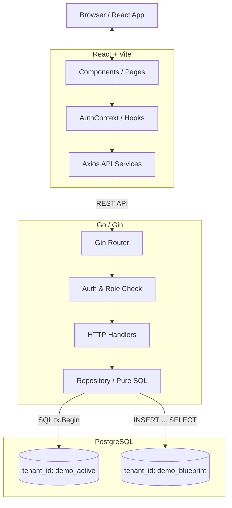

# 🌟 Golden State: B2B SaaS Demo Platformu

> B2B yazılım demolarında bozulan verileri milisaniyeler içinde "İlk Günkü Satışa Hazır" durumuna getiren, yüksek performanslı Go & React uygulaması.


---

## 🎯 The Problem & The Solution (Neden Yapıldı?)

### 🔴 Problem: Kirlenen Demo Verileri
B2B SaaS ürünlerinin satış toplantılarında (demolarda) karşılaşılan en büyük problem, **verilerin kirlenmesidir**. Satış temsilcileri ürünü müşteriye gösterirken yeni kayıtlar ekler, var olanları değiştirir veya siler. Ardından gelen bir sonraki toplantıda sistem "kullanılmış ve dağınık" bir halde bulunur. Her toplantı öncesi veritabanını manuel olarak temizlemek veya sıfırdan seed verisi yüklemek büyük bir zaman ve efor kaybıdır.

### 🟢 Çözüm: "Sihirli" Golden State Butonu
Golden State mimarisi, satış temsilcisine tek bir **"Sihirli Buton"** sunar. Toplantı bittiğinde veya yeni bir demo öncesinde Admin bu butona basarak tüm sistemi **saniyeler içinde ilk "Altın Durumuna" (Golden State) geri döndürür**. Müşteri verileri sıfırlanırken, sistemin ideal sunum hali korunur. Satış ekibi her demoya kusursuz, güvenilir ve tutarlı bir platform ile başlar.

---

## ⚙️ Under the Hood (Nasıl Çalışıyor?)

Sıfırlama işlemi sıradan bir tablonun silinip (`TRUNCATE`) baştan yaratılması veya dışarıdan yavaş bir SQL dosyasının (dump) içeri aktarılması **değildir**. Arka planda yüksek performanslı ve izole bir **Tenant Mimarısi** çalışır.

| Aşama | Teknik Detay |
| :--- | :--- |
| **İzolasyon** | Veritabanında aynı tabloda (`books` vb.) veriler `tenant_id` bazında izole edilir. Uygulamanın anlık kullandığı ve kirlenmeye müsait veriler `demo_active` tenant'ındadır. Geliştirme aşamasında üretilmiş, asla değiştirilmeyen "Altın Şablon" verisi ise `demo_blueprint` tenant'ında yaşar. |
| **Concurrency (Eşzamanlılık)** | Go tarafında `sync.Mutex` ve `TryLock` kullanılarak aynı anda yalnızca bir sıfırlama işleminin çalışması garanti altına alınır. İşlem sırasında gelen diğer istekler anında reddedilir. |
| **Atomik İşlem (Transaction)** | ORM kullanılmamıştır. Go'nun `database/sql` paketi ile saf SQL kullanılarak işlemler başlatılır (`tx.Begin()`). |
| **INSERT ... SELECT** | `demo_active` kayıtları (`DELETE FROM ...`) silindikten hemen sonra, veritabanı motoru seviyesinde `INSERT INTO ... SELECT ... FROM ... WHERE tenant_id = 'demo_blueprint'` operasyonu ile altın şablon, `demo_active` olarak klonlanır. |
| **Milisaniye Seviyesinde Hız** | İşlemlerin tümü veritabanı motoru (PostgreSQL) içinde gerçekleştiği için veri ağda gidip gelmez. Değişiklikler tek bir `Commit` ile kalıcı hale gelir. Sonuç: **Milisaniyeler içinde atomik ve tutarlı bir reset işlemi.** |

---

## 🏗️ Architecture & Stack

Proje, katmanlı bir mimari yaklaşımıyla tasarlanmıştır. Backend tarafında ORM'siz, performansa odaklı bir yapı tercih edilirken, Frontend tarafında modern araçlar kullanılmıştır.



### 🗂️ Katman Özeti
- **Frontend:** React, Vite (hızlı build), Tailwind CSS (styling), Context API (state yönetimi).
- **Backend:** Go, Gin (HTTP framework), `database/sql` (veri erişimi), JWT (kimlik doğrulama).
- **Veritabanı:** PostgreSQL (Docker üzerinde).

---

## 🚀 Getting Started (Kurulum)

Projeyi kendi ortamınızda çalıştırmak için aşağıdaki adımları izleyin.

### Ön Koşullar
- [Docker & Docker Compose](https://www.docker.com/)
- [Go](https://go.dev/) (v1.21+)
- [Node.js](https://nodejs.org/) (v18+) & npm

### Adım 1: Altyapıyı Ayağa Kaldırın (Veritabanı)

```bash
# Proje dizinine gidin
cd BookMarketWGoldenState

# PostgreSQL veritabanını başlatın
docker-compose up -d
```

### Adım 2: Backend'i Çalıştırın (Go)

```bash
# Gerekli Go bağımlılıklarını indirin
go mod tidy

# API servisini başlatın
go run ./cmd/api/main.go
```
*Backend varsayılan olarak `http://localhost:8080` portunda çalışacaktır.*

### Adım 3: Frontend'i Çalıştırın (React)

Yeni bir terminal penceresi açın:

```bash
# Frontend dizinine gidin
cd frontend

# Bağımlılıkları yükleyin
npm install

# Geliştirme sunucusunu başlatın
npm run dev
```
*Frontend varsayılan olarak `http://localhost:5173` portunda çalışacaktır.*
