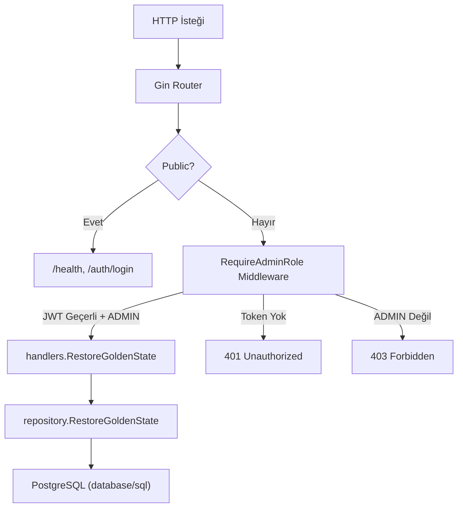

# Golden State — Teknik İnceleme & Sonraki Adımlar

## 1. Teknik Özet: Sistemi Anlıyorum

### Mimari
Proje, klasik **katmanlı Go backend** mimarisine uygun inşa edilmiş:



| Katman | Dosya | Sorumluluk |
|--------|-------|------------|
| **Giriş noktası** | `cmd/api/main.go` | `.env` yükleme, DB bağlantısı, Seed, Gin router, graceful shutdown |
| **DB havuzu** | `internal/db/db.go` | `database/sql` + `lib/pq`, bağlantı havuzu (25 open / 10 idle) |
| **Seed** | `internal/db/seeder.go` | `go:embed` ile `seed.sql`'i binary'ye gömer, Transaction içinde çalıştırır |
| **Models** | `internal/models/user.go` | `Role` enum'ları (`ADMIN/SELLER/BUYER`) + `DemoClaims` JWT struct |
| **Auth Handler** | `internal/handlers/auth_handler.go` | Sabit kullanıcı listesinden doğrulama, 24h JWT üretimi (HS256) |
| **Middleware** | `internal/middleware/auth.go` | Bearer token parse, HMAC doğrulama, ADMIN rol kontrolü |
| **Repository** | `internal/repository/restore_repository.go` | ⭐ Golden State Transaction mantığı |
| **System Handler** | `internal/handlers/system_handler.go` | `/api/v1/system/restore` endpoint'i, süre ölçümü |

### 🔑 Golden State Transaction Mantığı

**Bu projenin kalbi** [restore_repository.go](file:///d:/my-projects/BookMarketWGoldenState/internal/repository/restore_repository.go) içindeki `RestoreGoldenState` fonksiyonudur. Çalışma mantığı:

```
tx.Begin()
  ├── DELETE FROM books WHERE tenant_id = 'demo_active'
  ├── INSERT INTO books (...) SELECT 'demo_active', ... FROM books WHERE tenant_id = 'demo_blueprint'
  └── tx.Commit() ✅ (hata varsa tx.Rollback() ↩)
```

**Neden bu tasarım doğru?**
- Tek Transaction = **atomik garanti** → ya her şey olur ya da hiçbir şey olmaz
- Restore sırasında bir okuyucu (Buyer) asla "yarım veri" görmez (PostgreSQL MVCC izolasyonu)
- `INSERT ... SELECT` → veriler sunucu tarafında kopyalanır, ağ üzerinden aktarılmaz (performans)
- `RestoreResult` ile silinen/eklenen satır sayısı ve **millisaniye cinsinden süre** ölçülüp API'den döndürülüyor

### 🛡 Güvenlik Katmanı
- `RequireAdminRole` middleware'i **yalnızca ADMIN** rolüne sahip JWT token'lara geçiş izni verir
- Token imzalama algoritması kontrolü yapılıyor (`*jwt.SigningMethodHMAC` assertion → Algorithm Confusion saldırısına karşı koruma)
- Login endpoint'inde hangi alanın hatalı olduğu ifşa edilmiyor (güvenlik best practice)

---

## 2. İyileştirme Önerileri

### 🔴 Kritik — Güvenlik

> [!CAUTION]
> **`system_handler.go:20` — Hata mesajında iç hata detayı sızdırılıyor**

```go
"error": "Golden State sıfırlama işlemi başarısız: " + err.Error(),
```

`err.Error()` PostgreSQL hata mesajlarını, tablo isimlerini ve sorgu detaylarını dışarıya açabilir. Production'da bu bir bilgi sızıntısıdır.

**Önerilen düzeltme:** İç hatayı logla, kullanıcıya genel mesaj dön:
```go
log.Printf("HATA: Golden State restore başarısız: %v", err)
c.JSON(500, gin.H{"error": "Sistem sıfırlama işlemi sırasında bir hata oluştu."})
```

### 🟡 Orta — Performans & Dayanıklılık

| # | Konu | Detay |
|---|------|-------|
| 1 | **DB bağlantı havuzu `MaxConnLifetime` eksik** | `db.go`'da `SetConnMaxLifetime` ayarlanmamış. PostgreSQL'in `idle_in_transaction_session_timeout` ile bağlantıları kapatması durumunda "stale connection" hatası alınabilir. `DB.SetConnMaxLifetime(30 * time.Minute)` eklenmeli. |
| 2 | **Migrasyon uygulama başlangıcına dahil değil** | `001` ve `002` migrasyon dosyaları manuel `psql` ile çalıştırılıyor. Eğer biri yeni bir ortam kurarsa migrasyon betiğini çalıştırmayı unutabilir. Bunlar uygulama açılışında (Seed'den önce) otomatik çalıştırılabilir. |
| 3 | **Restore sırasında rate-limiting yok** | Admin token'ı olan biri restore endpoint'ini saniyede yüzlerce kez çağırabilir. Basit bir in-memory veya `sync.Mutex` tabanlı kilit eklenebilir. |

### 🟢 Düşük — Kod Kalitesi

| # | Konu |
|---|------|
| 1 | `STATE.md` "Aktif Görev" bölümü hâlâ "Phase 2 için Başla bekleniyor" yazıyor — güncellenebilir |
| 2 | `db.DB` global değişken olarak açığa çıkarılmış. Dependency injection ile handler'lara constructor üzerinden geçirilse test edilebilirlik artar |
| 3 | `docker-compose.yml` içindeki `version: '3.9'` satırı Docker Compose v2'de deprecate edilmiş (logda uyarı gördük) — kaldırılabilir |

---

## 3. Sonraki Adım Önerileri (3 Profesyonel Yol)

### Yol A: 🧪 **Unit/Integration Testler + CI Pipeline** *(Mühendislik olgunluğu)*

Neden bu? Backend'in çalıştığını biliyoruz ama **kanıtı yok**. Testler hem güven hem de gelecekte yapılacak refactor'ları güvence altına alır.

Kapsam:
- `repository.RestoreGoldenState` → Integration test (Docker test container ile gerçek PostgreSQL)
- `middleware.RequireAdminRole` → Unit test (geçerli/geçersiz/eksik token senaryoları)
- `handlers.Login` → Unit test (başarılı login, yanlış şifre, geçersiz format)
- GitHub Actions CI pipeline → her push'ta `go test ./...`

---

### Yol B: 📖 **Swagger/OpenAPI Dokümantasyonu** *(API tüketici deneyimi)*

Neden bu? Demo uygulaması olduğu için frontend geliştiricisi veya müşteri API'yi kolayca keşfedebilmeli.

Kapsam:
- `swaggo/swag` ile Go struct'larından otomatik OpenAPI spec üretimi
- `gin-swagger` ile `/swagger/index.html` UI endpoint'i
- Her endpoint için request/response örnekleri

---

### Yol C: 🖥 **Frontend Geliştirme** *(Demo-ready ürün)*

Neden bu? Proje bir **B2B satış demosu**. Backend hazır ama müşteriye gösterebileceğin görsel bir arayüz olmadan demo eksik kalır.

Kapsam:
- React + Vite ile basit SPA
- Login sayfası (admin/seller/buyer seçimi)
- Kitap listesi (demo_active verisinden)
- Admin paneli → "Golden State'e Dön" butonu (restore API'yi çağırır)
- Docker Compose'a frontend servisi eklenmesi

---

### 🎯 Benim Tavsiyem

> **Yol A (Testler) → Yol C (Frontend)** sıralamasını öneririm.

Testler, frontend geliştirirken backend'de yapacağın kaçınılmaz küçük değişikliklerin (yeni endpoint, CORS, vb.) mevcut sistemi kırmadığından emin olmanı sağlar. Swagger ise frontend geliştirme sırasında paralel olarak eklenebilir.
